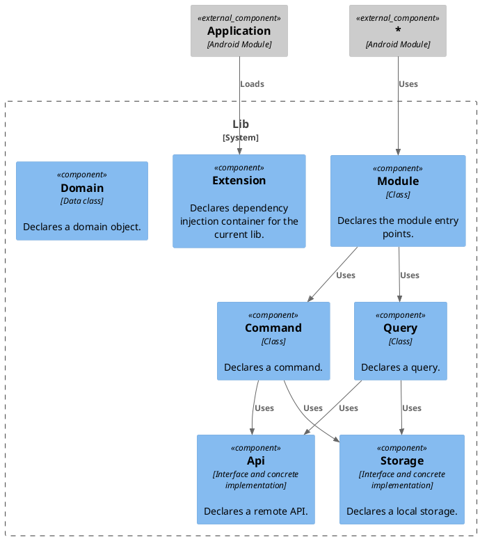

# Lib

```plantuml
@startuml
!include <C4/C4_Component>

Component_Ext(app, "Application", "Android Module")
Component_Ext(star, "*", "Android Module")
System_Boundary(c2, "Lib") {
    Component(extension, "Extension", "", "Declares dependency injection container for the current lib.")
    Component(module, "Module", "Class", "Declares the module entry points.")
    Component(command, "Command", "Class", "Declares a command.")
    Component(query, "Query", "Class", "Declares a query.")
    Component(domain, "Domain", "Data class", "Declares a domain object.")
    Component(api, "Api", "Interface and concrete implementation", "Declares a remote API.")
    Component(storage, "Storage", "Interface and concrete implementation", "Declares a local storage.")
}

Rel(app, extension, "Loads")
Rel(star, module, "Uses")
Rel(module, command, "Uses")
Rel(module, query, "Uses")
Rel(query, api, "Uses")
Rel(command, api, "Uses")
Rel(query, storage, "Uses")
Rel(command, storage, "Uses")
@enduml
```
