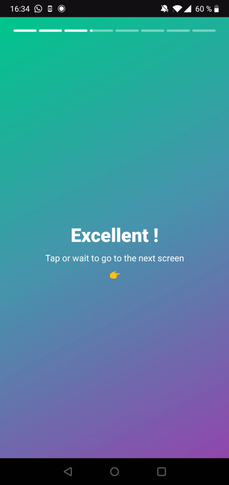
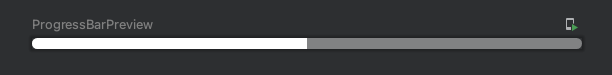
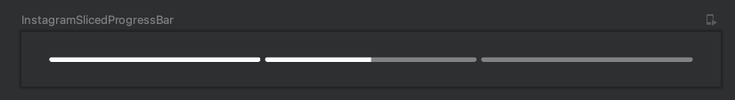

# Create an animated Instagram-like progress bar with Jetpack Compose

Jetpack Compose is the new and trending way to build Android UI.
At [BAM](https://bam.tech), we use it on all new projects. On older projects, we make a plan to refactor good old XML to Composable.

This is the first post of a series of How to do this with Jetpack Compose.

???+ note
    Posts in this series :

    - [Create an animated Instagram-like progress bar with Jetpack Compose](/blog/create-an-animated-instagram-like-progress-bar-with-jetpack-compose)
    - [Detect Instagram-like gestures with Jetpack Compose](/blog/detect-instagram-like-gestures-with-jetpack-compose)

??? info
    Resources :

    - [Link to Github Repo](https://github.com/bamlab/android-live-coding)
    - [Link to Figma project](https://www.figma.com/file/skHQUPywP3fQ80ytC8l9Ov/Live-Coding?node-id=0%3A1)

Let's go !

## Recreating Instagram's stories progress bar

Do you know instagram stories ? They are a slideshow of full screen mobile pictures. Here is an example :

{ style="max-height: 40vh; margin: 0 auto; display: block;" }

We will try to recode the progress bar like this :

{ style="max-height: 40vh; margin: 0 auto; display: block;" }

Specs are :

- [x] we are given a number of steps (number);
- [x] we are given the current step index (number);
- [x] we are given whether to pause the progression or not (boolean);
- [x] we would like to be able to do something when we reach the end of a step (a callback);

## The layout of one progress bar

We will use a `Row` with a background for the progress bar background.
And a `Box` for the progress bar foreground.

``` kotlin
@Preview(widthDp = 200)
@Composable
fun ProgressBarPreview() {
    Row(
        modifier = Modifier
            .height(4.dp)
            .clip(RoundedCornerShape(50, 50, 50, 50)) // (1)
            .background(Color.White.copy(alpha = 0.4f)) // (2)
    ) {
        Box(
            modifier = Modifier
                .background(Color.White)
                .fillMaxHeight()
                .fillMaxWidth(0.5f), // (3)
        ) {}
    }
}
```

1. Creates rounded corner. Order of `Modifier` is important. Here, `clip` is applied on top of `background`.
2. Adds the white translucent background.
3. Fill a percentage of the width.

*Result :*



## The layout of multiple progress bar

We need to iterate over an index.

``` kotlin
@Preview(widthDp = 600)
@Composable
fun InstagramSlicedProgressBar(
    steps: Int = 3,
    currentStep: Int = 2
) {
    Row(
        verticalAlignment = Alignment.CenterVertically,
        modifier = Modifier
            .height(48.dp)
            .padding(24.dp, 0.dp),
        ) {
        for (index in 1..steps) { // (1)
			// We use our previous code :
            Row(
                ...
            ) {
                Box(
                    modifier = Modifier
                        ...
                        .fillMaxHeight().let {
							// Here we check if we need to fill the progress bar of not :
                            when (index) { // (2)
                                currentStep -> it.fillMaxWidth(.5f)
                                in 0..currentStep -> it.fillMaxWidth(1f)
                                else -> it
                            }
                        },
                ) {}
            }
            if (index != steps) {
                Spacer(modifier = Modifier.width(4.dp)) // (3)
            }
        }
    }
}
```

1. We iterate over a range from 1 to the given steps number.
2. Before current step, we fill the progress bar; at the current step, we fill a fraction; after, we do nothing.
3. We insert a `Spacer` between each progress bar.


*Result :*



### Animation and pause

We will need a `LaunchedEffect` :

``` kotlin
@Preview(widthDp = 600)
@Composable
fun InstagramSlicedProgressBar(
    steps: Int = 3,
    currentStep: Int = 2,
    paused: Boolean = false,
    onFinished: () -> Unit = {}
) {
    val percent = remember { Animatable(0f) } // (1)
    LaunchedEffect(paused) { // (2)
        if (paused) percent.stop()
        else {
            percent.animateTo(
                targetValue = 1f,
                animationSpec = tween(
                    durationMillis = (5000 * (1f - percent.value)).toInt(), // (3)
                    easing = LinearEasing
                )
            )
            onFinished() // (4)
        }
    }
    Row(...) {
        for (...) {
            Row(...) {
                Box(
                    modifier = Modifier
                        ...
                        .fillMaxHeight().let {
                            when (index) {
                                currentStep -> it.fillMaxWidth(percent.value) // (5)
                                ...
                            }
                        },
                ) {}
            }
            ...
        }
    }
}
```

1. Creates an animated value that the composable will remember across recompositions.
2. Every time `paused` changes, launch the effect in a coroutine.
3. Animate from the current value to 100% with the following spec.
	- [x] It should take 5 seconds to go from 0 to 100%
4. Calls the `onFinished` callback once animation is done.
5. Use our animated value current value to fill current step.

Tadaaa 🎉
We are done with our progress bar !
