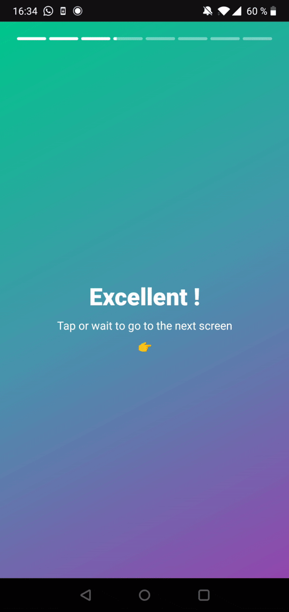

# Detect Instagram-like gestures with Jetpack Compose

This is the second article of a series about Jetpack Compose.

???+ note
    Posts in this series :

    - [Create an animated Instagram-like progress bar with Jetpack Compose](/blog/create-an-animated-instagram-like-progress-bar-with-jetpack-compose)
    - [Detect Instagram-like gestures with Jetpack Compose](/blog/detect-instagram-like-gestures-with-jetpack-compose)

??? info
    Resources :

    - [Link to Github Repo](https://github.com/bamlab/android-live-coding)
    - [Link to Figma project](https://www.figma.com/file/skHQUPywP3fQ80ytC8l9Ov/Live-Coding?node-id=0%3A1)

## What we'll try to achieve

- [x] On press on the 1st left quarter of the screen : go to previous screen.
- [x] On press on the right 3 quarters of the screen : go to next screen.
- [x] On press-and-hold anywhere : pause the progress bar.
- [x] On progress bar finished : go to next screen.

{ style="max-height: 40vh; margin: 0 auto; display: block;" }

## Recreating Instagram's stories screen

Let's warm up by using our progress bar in a typical Instagram's like screen.

``` kotlin
@Composable
fun InstagramScreen() {
	// We will hardcode those parameter for now.
	val steps = 5;
	val currentStep = 2;
	val isPressed = remember { mutableStateOf(false) }
	val goToPreviousScreen = {}
	val goToNextScreen = {}

	Column(
        horizontalAlignment = Alignment.CenterHorizontally,
        modifier =
        Modifier
            .background(
                Brush.linearGradient( // (1)
                    colors = listOf(GreenLemon, GreenLeaves, BlueSea), // (2)
                    start = Offset.Zero, end = Offset.Infinite
                )
            )
    ) {
        InstagramSlicedProgressBar(steps, currentStep, isPressed.value, goToNextScreen)
        Column(
            horizontalAlignment = Alignment.CenterHorizontally,
            verticalArrangement = Arrangement.Center,
            modifier = Modifier.weight(1f)
        ) {
            Text(
                text = "Hello world !",
                style = Typography.h1,
                color = Color.White
            )
            Spacer(modifier = Modifier.height(8.dp))
            Text(
                text = "Tap or wait to go to the next screen",
                style = Typography.body1,
                color = Color.White
            )
            Spacer(modifier = Modifier.height(8.dp))
            Text(
                text = "👉",
                style = Typography.body1,
                color = Color.White
            )
        }
    }
}
```

1. This is the way of creating a linear gradient ! Very useful.
2. Use a list of colours that you like.
   Mine is :
   ``` kotlin
   	val GreenLemon = Color(0xFFA9F24D)
	val GreenLeaves = Color(0xFF00C88C)
	val BlueSea = Color(0xFF4895AD)
	val Purple = Color(0xFF9248AD)
	val RedRaspberry = Color(0xFFE2264C)
   ```

## Adding gestures

Adding gestures to this screen is not very complicated. Jetpack Compose `pointerInput` modifier is very handful in this situation :

``` kotlin
@Composable
fun InstagramScreen() {
	// We will hardcode those parameter for now.
	val steps = 5;
	val currentStep = 2;
	val isPressed = remember { mutableStateOf(false) }
	val goToPreviousScreen = {}
	val goToNextScreen = {}

	Column(
        horizontalAlignment = Alignment.CenterHorizontally,
        modifier =
        Modifier
            .background(
                ...
            ).pointerInput(Unit) { // (1)
                val maxWidth = this.size.width // (2)
                detectTapGestures(
                    onPress = { // (3)
                        val pressStartTime = System.currentTimeMillis()
                        isPressed.value = true
                        this.tryAwaitRelease() // (4)
                        val pressEndTime = System.currentTimeMillis()
                        val totalPressTime = pressEndTime - pressStartTime // (5)
                        if (totalPressTime < 200) {
                            val isTapOnRightTwoTiers = (it.x > (maxWidth / 4)) // (6)
                            if (isTapOnRightTwoTiers) {
                                goToNextScreen()
                            } else {
                                goToPreviousScreen()
                            }
                        }
                        isPressed.value = false
                    },
                )
            }
    ) {
		...
	}
}
```

1. `pointerInput` installs a gesture detector. It is attached to some key. If the key change on recomposition, the previous gesture detector is detached and a new one is created.
   
	Here we use `Unit` because we want to install a permanent gesture detector.

2. We can retrieve the Composable's width inside a `PointerInputScope` ! Wow !
   
3. `detectTapGestures`'s `onPress` attribute is what we need to detect custom on-press behaviours. It expects a suspend function and provide in its scope a suspendable `awaitRelease` and `tryAwaitRelease` functions.
    
	Those functions pause the coroutine execution until the user releases its gesture !

4. We wait for the user to release its gesture.
   

## Setting up the navigation

We can easily set up a navigation with the `androidx.navigation:navigation-compose` package.

``` groovy
    implementation("androidx.navigation:navigation-compose:2.4.0-alpha03")
```

Here is our entry point :

``` kotlin
@Composable
fun Navigation() {
    val navController = rememberNavController()
    NavHost(navController = navController, startDestination = "instagram/{steps}/{currentStep}") { // (1)
        composable( // (2)
            "instagram/{steps}/{currentStep}",
            arguments = listOf(
                navArgument("steps") { type = NavType.IntType; defaultValue = 8 }, // (3)
                navArgument("currentStep") { type = NavType.IntType; defaultValue = 1 }, // (4)
            )
        ) { backStackEntry -> // (5)
            InstagramScreen(
                navController,
                backStackEntry.arguments!!.getInt("steps"),
                backStackEntry.arguments!!.getInt("currentStep"),
            )
        }
    }
}
```

1. Here we declare our router. Its start destination is `instagram/{steps}/{currentStep}`.
2. We declare a route. There are some navigation params : `steps` and `currentStep`.
3. `steps` is an `Int`; we can use a default value.
4. `currentStep` is an `Int`; we can use a default value.
5. We pass down our navigation params thanks to `backStackEntry` argument.

Remember our hardcoded values ? Let's change those :

``` kotlin
@Composable
fun InstagramScreen(navController: NavController, steps: Int, currentStep: Int) {
    val goToNextScreen = {
        if (currentStep + 1 <= steps) navController.navigate("instagram/$steps/${currentStep + 1}")
    }
    val goToPreviousScreen = {
        if (currentStep - 1 > 0) navController.navigate("instagram/$steps/${currentStep - 1}")
    }

	...
}
```

Here you go !

The final result is here :

{ style="max-height: 40vh; margin: 0 auto; display: block;" }
