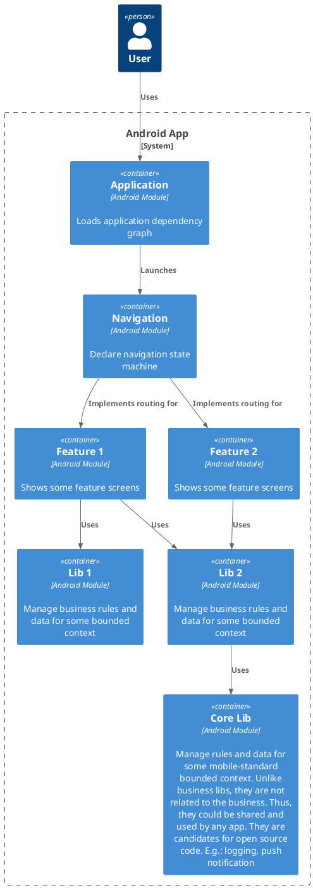

# Architecture

```plantuml
@startuml
!include <C4/C4_Container>

Person(user, "User")
System_Boundary(c1, "Android App") {
    Container(app, "Application", "Android Module", "Loads application dependency graph")
    Container(navigation, "Navigation", "Android Module", "Declare navigation state machine")
    Container(feature_1, "Feature 1", "Android Module", "Shows some feature screens")
    Container(feature_2, "Feature 2", "Android Module", "Shows some feature screens")
    Container(lib_1, "Lib 1", "Android Module", "Manage business rules and data for some bounded context")
    Container(lib_2, "Lib 2", "Android Module", "Manage business rules and data for some bounded context")
    Container(core, "Core Lib", "Android Module", "Manage rules and data for some mobile-standard bounded context. Unlike business libs, they are not related to the business. Thus, they could be shared and used by any app. They are candidates for open source code. E.g.: logging, push notification")
}

Rel(user, app, "Uses")
Rel(app, navigation, "Launches")
Rel(navigation, feature_1, "Implements routing for")
Rel(navigation, feature_2, "Implements routing for")
Rel(feature_1, lib_1, "Uses")
Rel(feature_1, lib_2, "Uses")
Rel(feature_2, lib_2, "Uses")
Rel(lib_2, core, "Uses")
@enduml
```
