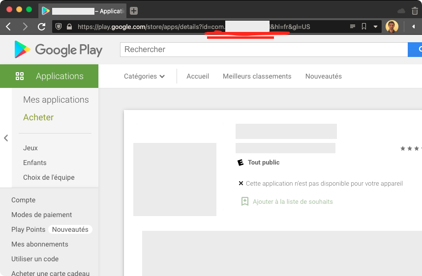
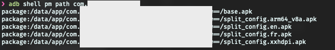
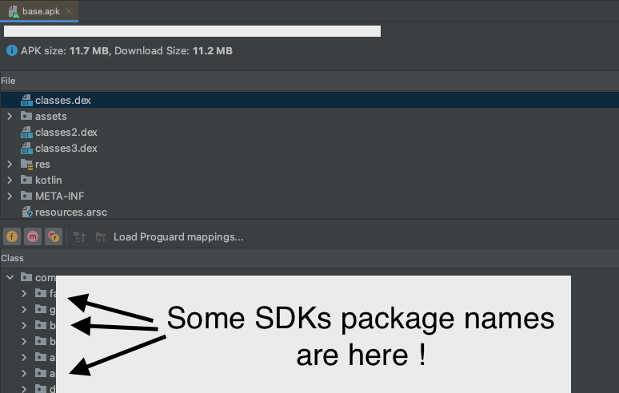

# Android Debug Bridge

## How to known which SDKs an app uses

Opening an apk reveals a LOT about which SDK some Android app use Visage de robot I was curious about what other use in their app (Jetpack Compose ? React Native ? Flutter ? Native libs ?). Want to try out ?

Take your Android phone (or emulator), download an app ⬇️

You need to get the package name of the app.

Two ways of doing this :

1. Open your desktop's browser, check the app's Play Store url, it's there :
	

2. Or open the app and use this command : `adb shell dumpsys activity activities`. In the logs, you should see which activity is on top.

Once you have the package name, find the apk location with this command : `adb shell pm path the.package.name.you.found.previously`. It returns the location of all apk and the base apk location.

Pull it with `adb pull the/location/found/previously`

Open it in Android Studio. Open the classes.dex files and tadaaa Bombe de table You recognize some sdk/lib package names.

