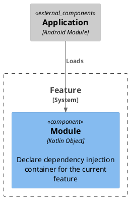

# Feature

```plantuml
@startuml
!include <C4/C4_Component>

Component_Ext(app, "Application", "Android Module")
System_Boundary(c2, "Feature") {
    Component(module, "Module", "Kotlin Object", "Declare dependency injection container for the current feature")
}

Rel(app, module, "Loads")
@enduml
```
