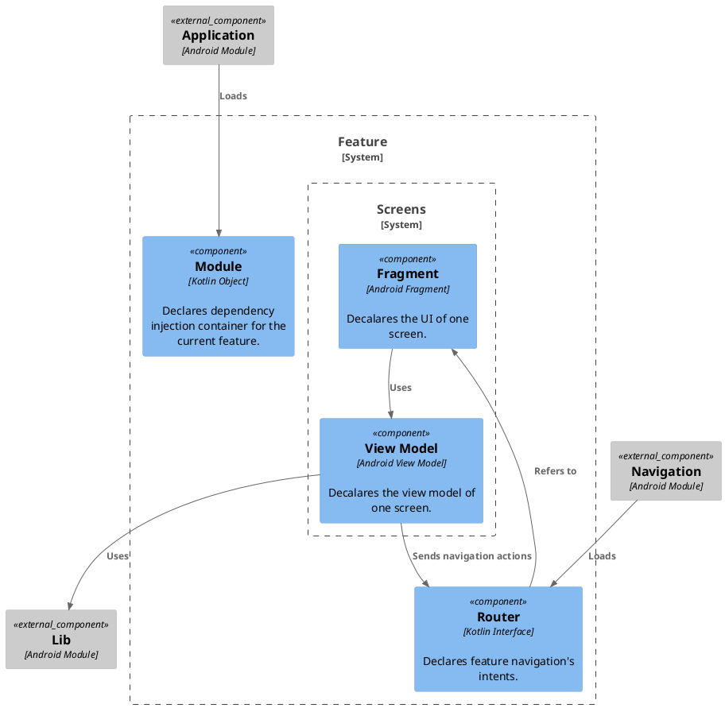

# Feature

```plantuml
@startuml
!include <C4/C4_Component>

Component_Ext(app, "Application", "Android Module")
Component_Ext(navigation, "Navigation", "Android Module")
Component_Ext(lib, "Lib", "Android Module")
System_Boundary(c2, "Feature") {
    Component(module, "Module", "Kotlin Object", "Declares dependency injection container for the current feature.")
    Component(router, "Router", "Kotlin Interface", "Declares feature navigation's intents.")
    System_Boundary(sreens, "Screens") {
        Component(fragment, "Fragment", "Android Fragment", "Decalares the UI of one screen.")
        Component(viewmodel, "View Model", "Android View Model", "Decalares the view model of one screen.")
    }
}

Rel(app, module, "Loads")
Rel(navigation, router, "Loads")
Rel(router, fragment, "Refers to")
Rel(fragment, viewmodel, "Uses")
Rel(viewmodel, router, "Sends navigation actions")
Rel(viewmodel, lib, "Uses")
@enduml
```
