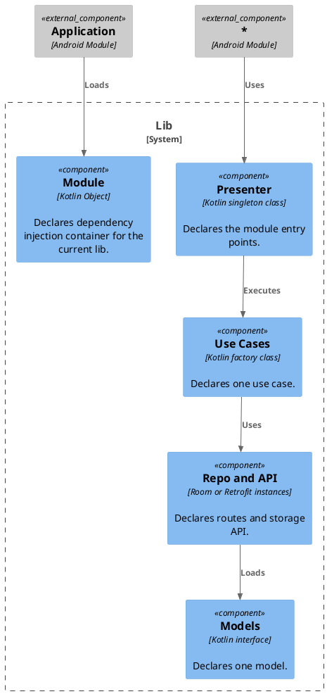

# Lib

```plantuml
@startuml
!include <C4/C4_Component>

Component_Ext(app, "Application", "Android Module")
Component_Ext(star, "*", "Android Module")
System_Boundary(c2, "Lib") {
    Component(module, "Module", "Kotlin Object", "Declares dependency injection container for the current lib.")
    Component(presenter, "Presenter", "Kotlin singleton class", "Declares the module entry points.")
    Component(usecase, "Use Cases", "Kotlin factory class", "Declares one use case.")
    Component(repo_api, "Repo and API", "Room or Retrofit instances", "Declares routes and storage API.")
    Component(model, "Models", "Kotlin interface", "Declares one model.")
}

Rel(app, module, "Loads")
Rel(star, presenter, "Uses")
Rel(presenter, usecase, "Executes")
Rel(usecase, repo_api, "Uses")
Rel(repo_api, model, "Loads")
@enduml
```
