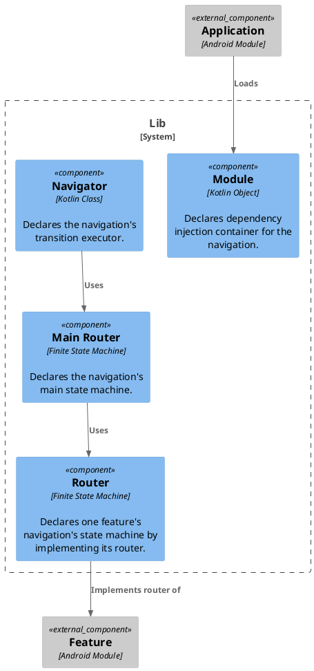

# Navigation

```plantuml
@startuml
!include <C4/C4_Component>

Component_Ext(app, "Application", "Android Module")
Component_Ext(feature, "Feature", "Android Module")
System_Boundary(c2, "Lib") {
    Component(module, "Module", "Kotlin Object", "Declares dependency injection container for the navigation.")
    Component(navigator, "Navigator", "Kotlin Class", "Declares the navigation's transition executor.")
    Component(main_router, "Main Router", "Finite State Machine", "Declares the navigation's main state machine.")
    Component(router, "Router", "Finite State Machine", "Declares one feature's navigation's state machine by implementing its router.")
}

Rel(app, module, "Loads")
Rel(navigator, main_router, "Uses")
Rel(main_router, router, "Uses")
Rel(router, feature, "Implements router of")
@enduml
```
