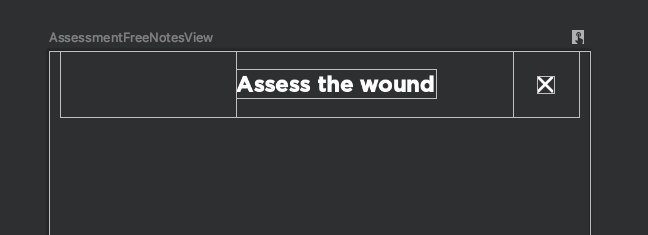

# Layout with Jetpack Compose

## Column

Of course.

## Row

Of course.

## Box

Use box to stack elements in a box. Use it as `position: absolute` web CSS replacement.

For example, when you need to center a title and align a button to the right, use a box.

