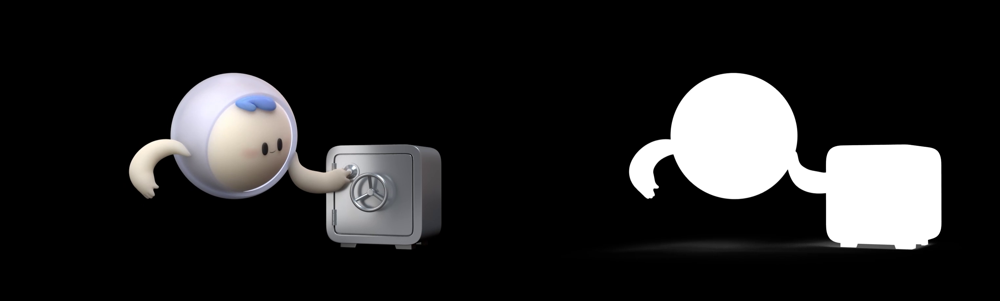

# CIFilter

[cifilter.io](https://cifilter.io)

## Barcode and QRCode

You can generate a barcode / a QRcode with CI Filter

The code below needs to be run in a playground.

``` swift
import UIKit
import PlaygroundSupport

class MyViewController : UIViewController {
  override func loadView() {
    super.loadView()
    let view = UIView()
    view.backgroundColor = .white
    
    let barcode = generateBarcode(from: "Hello world")
    view.addSubview(UIImageView(image: barcode))
    self.view = view
  }
  
  
  func generateBarcode(from string: String) -> UIImage? {
    let data = string.data(using: String.Encoding.ascii)
    
    if let filter = CIFilter(name: "CICode128BarcodeGenerator") { // (1)
      filter.setValue(data, forKey: "inputMessage")
      if let output = filter.outputImage {
        return UIImage(ciImage: output) // (2)
      }
    }
    return nil
  }
}
PlaygroundPage.current.liveView = MyViewController() // (3)
```

1. See cifilter.io for other code generator
2. Create image from filter output
3. Render the view controller in the playground

## Play a transparent video

Video format with transparant background are not supported on iOS.
First, generate your video in the mp4 format with the RGB channel on the left and the alpha channel (converted in grayscale) on the right.



See [Quentin Fasquel's artical](https://medium.com/@quentinfasquel/ios-transparent-video-with-coreimage-52cfb2544d54) to see how implement the CI Filter.

The key code:

```swift
extension MyView {
    private func setupVideoView() {
        let videoUrl = bundle.url(forResource: videoName, withExtension: "mp4")!
        let playerItem = AVPlayerItem(url: videoUrl)
        let player = AVQueuePlayer(items: [playerItem])
        playerLooper = AVPlayerLooper(player: player, templateItem: playerItem) // (1)
        let playerLayer = AVPlayerLayer(player: player)
        layer.addSublayer(playerLayer)

        playerLayer.bounds = bounds
        playerLayer.position = position

        playerLayer.pixelBufferAttributes = [kCVPixelBufferPixelFormatTypeKey as String: kCVPixelFormatType_32BGRA] // (2)
        playerItem.videoComposition = createVideoComposition(for: playerItem)

        player.seek(to: .zero)
        player.play()
    }

    private func createVideoComposition(for playerItem: AVPlayerItem) -> AVVideoComposition {
        let videoSize = onboardingTheme.videoSize
        let composition = AVMutableVideoComposition(asset: playerItem.asset, applyingCIFiltersWithHandler: { request in
            let sourceRect = CGRect(origin: .zero, size: videoSize)
            let alphaRect = sourceRect.offsetBy(dx: sourceRect.width, dy: 0) // (3)
            let transform = CGAffineTransform(translationX: -sourceRect.width, y: 0)
            let filter = AlphaFrameFilter()
            filter.maskImage = request.sourceImage.cropped(to: alphaRect).transformed(by: transform)
            filter.inputImage = request.sourceImage.cropped(to: sourceRect)
            return request.finish(with: filter.outputImage!, context: nil)
          })

        composition.renderSize = videoSize
        return composition
    }
}

class AlphaFrameFilter: CIFilter {
    static var kernel: CIColorKernel? = {
        CIColorKernel(source: """
        kernel vec4 alphaFrame(__sample s, __sample m) {
          return vec4( s.rgb, m.r );
        }
        """) // (4)
    }()

    var inputImage: CIImage?
    var maskImage: CIImage?

    override var outputImage: CIImage? {
        let kernel = AlphaFrameFilter.kernel!

        guard let inputImage = inputImage, let maskImage = maskImage else {
            return nil
        }

        let args = [inputImage as AnyObject, maskImage as AnyObject]
        return kernel.apply(extent: inputImage.extent, arguments: args)
    }
}
```

1. playerLopper is the object allowing us to loop the video. It should be declared as a property from the view. Otherwise, it will be garbage collected.
2. Indicate the player that it will recieve an alpha channel
3. We split the image in two: the original image and its mask
4. This code is in OpenGL. It created a 4-channel image from a 3-channel image and the mask