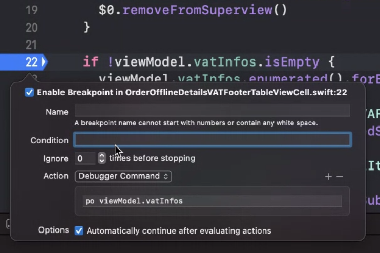
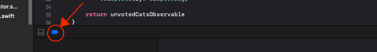
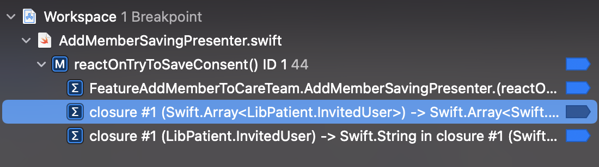

# Breakpoints

## With conditions

In Xcode, right-click on breakpoints to add conditions.
You can even do some actions, like `po` to print the variable in the console.



## Disable all breakpoints

When running your app, you can deactivate all your breakpoints and conserve their state, enabled or disabled. Just below the code area, select the blue arrow.



## Enable breakpoint only inside / outside

If you program in Swift, you are probably using [closures](https://docs.swift.org/swift-book/LanguageGuide/Closures.html) (similar to lambdas in other languages). Sometimes, your line contains both a closure and its surrounding environment. An extreme example can be this

```swift
func myFunction(dict: [String:[String]]) {
  dict.map { (key, value) in value.map { string in string.trimmingCharacters(in: .whitespaces) }
}
```

Here we have 2 closures and a surrounding environment. When building, Xcode expands the breakpoint in 3 sub-breakpoints in the breakpoint navigator. You can now enable or disable the one you want by looking at the closure signature.


