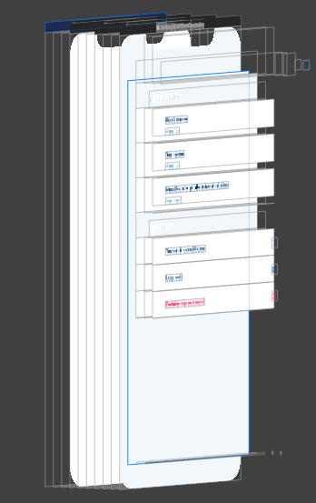
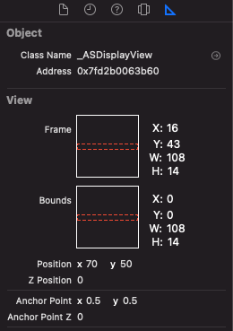

# Design

## View hierarchy

When running your app (it can be outside of a breakpoint), on the screen you want to verify, click on the “Debug view hierarchy”, on the bar between your code and the debugging area.

You can then see a 3D representation of your view with elements overlapping each other.

## Geometry details

When you select a specific element in Debug View hierarchy, in the inspector panel, you may also find precise information about the geometry.

