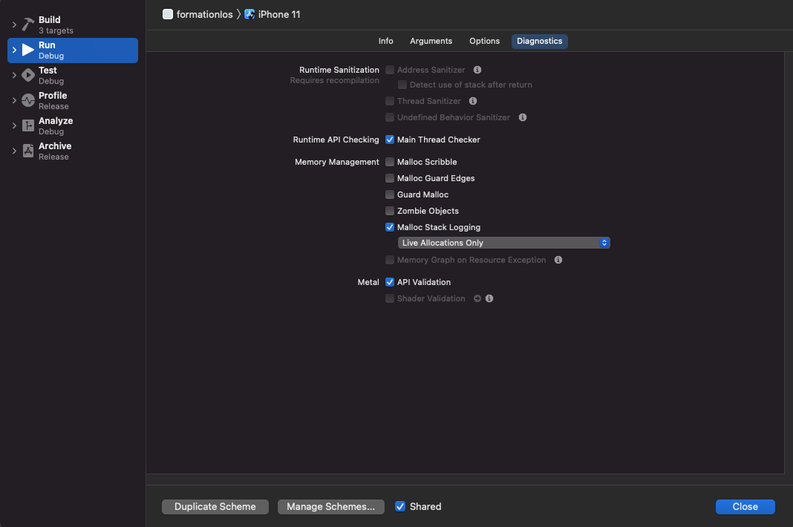
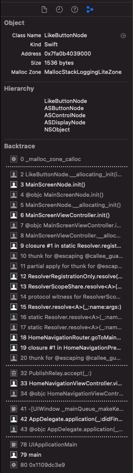

# Memory

## Memory graph

In Swift, objects are kept in memory as long as there is one strong reference to them. If you don’t use your object and it is still in memory, you probably forgot one strong reference.

To see what keeps an object alive, you can use the memory graph. Press the memory graph icon whenever you want while running the application. The only condition is that your device (or your simulator) must have a recent version of iOS (at least iOS 13.x when writing this article).

An arrow means “this object has a reference to this one”. If the arrow is bold, that means that the reference is a strong one.

## Backtrace of the object

Open your scheme. Select "Run" on the left panel, then "Diagnostics". You must now select the line "Malloc Stack Logging" as shown below.

You can then open the inspector panel, go to the memory inspector. It will load a precise backtrace of where your object is kept alive. You can even click on the lines to see the precise piece of code.

